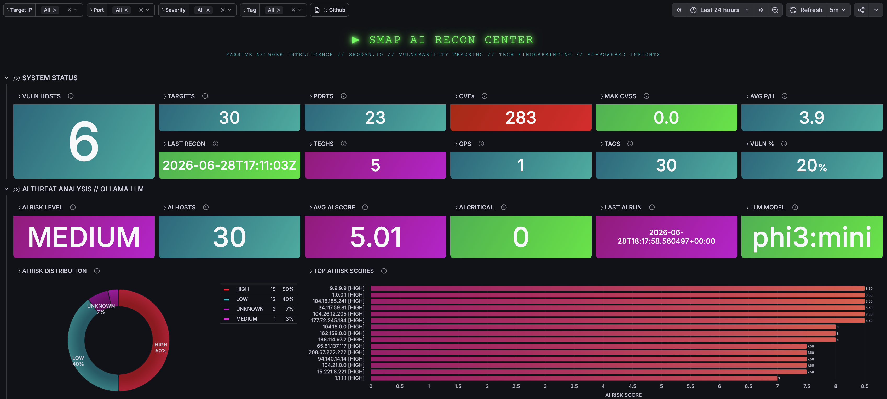
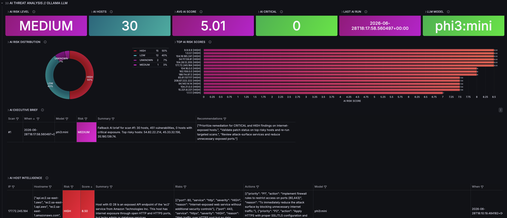

<p align="center">
  <a href="https://github.com/czantoine/smap-ai-recon-center/blob/main/LICENSE">
    
  </a>
  <a href="https://github.com/czantoine/smap-ai-recon-center">
    
  </a>
  <a href="https://github.com/czantoine/smap-ai-recon-center/issues">
    
  </a>
  <a href="https://hub.docker.com/r/czantoine/smap-ai-analyzer">
    
  </a>
  <a href="https://hub.docker.com/r/czantoine/smap-grafana">
    
  </a>
  
  
  
  
  
  <a href="https://www.linkedin.com/in/antoine-cichowicz-837575b1">
    
  </a>
</p>

<h1 align="center">Smap AI Recon Center</h1>

<p align="center">
  AI-powered passive network reconnaissance and threat intelligence platform built on Smap, SQLite, Grafana, and Ollama.
</p>

<p align="center">
  <a href="https://grafana.com/dashboards/24085">
    
  </a>
</p>

<p align="center">
  <b>Enjoying this project?</b><br>
  If it saves you time or helps your recon workflow, you can support ongoing updates by buying me a coffee.
</p>

<p align="center">
  <a href="https://ko-fi.com/V7V22V693">
    
  </a>
</p>

---

## Overview

**Smap AI Recon Center** is a lightweight, containerized platform for **passive attack surface visibility**, **threat intelligence exploration**, and **AI-assisted risk analysis**.

It combines:

- [**Smap**](https://github.com/s0md3v/Smap), a passive Nmap alternative built on **Shodan InternetDB**
- a Python-based **SQLite importer and enrichment pipeline**
- a **Grafana dashboard** for visualization and operational analysis
- an optional **local AI analysis layer** powered by **Ollama**

The platform transforms passive reconnaissance output into a structured security dataset enriched with:

- **CVSS scoring**
- **severity classification**
- **per-host risk scoring**
- **CPE-based technology fingerprinting**
- **host auto-tagging**
- **SSL/TLS metadata extraction**
- **geo-enrichment**
- **scan-over-scan drift detection**
- **AI-generated executive summaries and host-level threat assessments**

The result is a compact yet powerful recon and intelligence stack suitable for:

- security monitoring
- exposure review
- asset visibility
- lightweight SOC workflows
- red team reconnaissance tracking
- education, labs, and demonstrations



> To deploy the full stack locally, see the [Quickstart guide](quickstart/README.md).

---

## Key Capabilities

### Passive Reconnaissance & Enrichment

- Passive host and service discovery using **Shodan InternetDB**
- Import pipeline for **JSON, JSONL, XML, and nmap-style outputs**
- **CVSS normalization** and severity mapping
- **Per-host risk computation**
- **Technology extraction** from CPE strings
- **Automatic host tagging**
- **Geo and ASN enrichment**
- **SSL/TLS metadata extraction**
- Duplicate prevention and additive schema migration

### AI-Assisted Threat Analysis

- Fully local **LLM-based analysis** via **Ollama**
- **Per-host AI risk assessment**
- **Scan-level executive summaries**
- **Structured recommendations and remediation hints**
- AI output stored directly in **SQLite**
- No dependency on external AI SaaS platforms

### Visualization & Operations

- Grafana dashboard [(ID: **24085**)](https://grafana.com/grafana/dashboards/24085)
- Threat-centric and asset-centric views
- Operational history and drift tracking
- Filterable tables and interactive visualizations
- AI-focused dashboard section layered on top of the existing recon workflow

---

## Architecture

```text
        ┌────────────┐
        │ targets.txt│
        └─────┬──────┘
              │
              ▼
   ┌──────────────────────────────┐
   │        smap-importer         │
   │------------------------------│
   │ passive recon via Smap       │
   │ CVSS + severity scoring      │
   │ CPE tech fingerprinting      │
   │ host auto-tagging            │
   │ SSL/TLS extraction           │
   │ geo enrichment               │
   │ writes smap.db               │
   └──────────────┬───────────────┘
                  │
                  ▼
          ┌────────────────┐
          │    SQLite DB   │
          │    smap.db     │
          └──────┬─────────┘
                 │
      ┌──────────┴──────────┐
      ▼                     ▼
┌───────────────┐    ┌────────────────┐
│    Grafana    │    │  AI Analyzer   │
│---------------│    │----------------│
│ dashboard     │    │ Ollama-powered │
│ threat views  │    │ host analysis  │
│ asset views   │    │ scan summaries │
└───────────────┘    └────────────────┘
```

---

## Data Flow

1. **Smap** queries **Shodan InternetDB** for passive intelligence on each target.
2. **`import_smap.py`** parses and enriches the results, then writes them into **`smap.db`**.
3. **Grafana** reads SQLite through the `frser-sqlite-datasource` plugin and renders the dashboard.
4. The optional **AI analyzer** reads the same database, sends contextual host and scan data to **Ollama**, and stores the results back into SQLite.
5. The dashboard exposes both **raw passive recon intelligence** and **AI-generated contextual analysis**.

---

## Technology Stack

| Component | Role |
|---|---|
| **Smap** | Passive host, service, and vulnerability enumeration |
| **Python** | Import, enrichment, schema migration, AI orchestration |
| **SQLite** | Lightweight single-file datastore |
| **Grafana** | Dashboarding and operational visibility |
| **Ollama** | Local LLM runtime for AI analysis |
| **Docker Compose** | Reproducible deployment |

---

## Database Schema

The platform uses a single SQLite database: **`smap.db`**.

### Core tables

```text
scans
hosts
ports
vulnerabilities
technologies
host_tags
```

### AI tables

```text
ai_scan_analysis
ai_host_analysis
```

> The AI layer is strictly **additive**. It does not alter or break the existing importer schema.

<details>
<summary><b>Core schema reference</b></summary>

| Table | Main purpose |
|---|---|
| **scans** | Stores one row per scan/import |
| **hosts** | Stores enriched host-level intelligence |
| **ports** | Stores open ports and service metadata |
| **vulnerabilities** | Stores CVEs, CVSS, severity, and references |
| **technologies** | Stores parsed CPE-based technologies |
| **host_tags** | Stores generated host tags and their source |

</details>

<details>
<summary><b>AI schema reference</b></summary>

| Table | Main purpose |
|---|---|
| **ai_scan_analysis** | Executive AI scan summary and recommendations |
| **ai_host_analysis** | Per-host AI assessment with score and actions |

</details>

---

## Dashboard Coverage

The Grafana dashboard includes sections for:

### ⟩⟩⟩ SYSTEM STATUS
> Real-time KPIs for the current scan state.

| Panel | Description |
|---|---|
| LAST RECON | Timestamp of the most recent scan import |
| OPS | Total number of scan operations |
| TARGETS | Unique IPs matching current filters |
| PORTS | Distinct open ports |
| VULN HOSTS | Hosts with at least one CVE |
| CVEs | Unique CVE identifiers |
| TECHS | Distinct technologies from CPE parsing |
| TAGS | Distinct host tags |
| VULN % | Percentage of filtered hosts that are vulnerable |
| MAX CVSS | Highest CVSS score across all hosts |
| AVG P/H | Average open ports per host |


### ⟩⟩⟩ AI THREAT ANALYSIS
> AI-assisted risk interpretation, host prioritization, and executive threat summarization powered by Ollama.

| Panel | Description |
|---|---|
| AI RISK LEVEL | AI-assessed overall risk level for the latest analyzed scan |
| HOSTS ANALYZED | Number of hosts processed by the AI engine |
| AI HIGH+CRIT | Hosts classified by AI as HIGH or CRITICAL |
| AVG AI SCORE | Average AI-computed risk score across analyzed hosts |
| AI MODEL | LLM model used for the most recent analysis |
| LAST AI RUN | Timestamp of the most recent AI analysis execution |
| AI EXECUTIVE SUMMARY | Scan-level AI summary with contextual recommendations |
| AI RISK DISTRIBUTION | Donut chart of hosts by AI-generated risk level |
| AI vs STATIC RISK | Comparison between importer risk classification and AI interpretation |
| AI HOST THREAT INDEX | Ranked table of hosts with AI risk level, score, summary, and recommended actions |
| AI ASSESSMENT HISTORY | Historical table of AI scan summaries, model used, risk level, and recommendations |



### ⟩⟩⟩ THREAT MATRIX
> Vulnerability analysis and risk prioritization.

| Panel | Description |
|---|---|
| HOST THREAT INDEX | Sortable table: IP, vuln count, max CVSS, risk level, org, ports |
| SEVERITY BREAKDOWN | Donut chart of vulnerabilities by severity (color-coded) |
| EXPLOIT FREQUENCY | Donut chart of the 15 most common CVEs |
| RISK LEVELS | Donut chart of hosts by computed risk level |
| BLAST RADIUS | Bar chart: CVEs ranked by number of affected hosts (with severity label) |
| EXPLOIT DATABASE | Filterable table: CVE ↔ IP ↔ CVSS ↔ Severity ↔ Port ↔ Service |


### ⟩⟩⟩ ATTACK SURFACE & TECH FINGERPRINTING
> Service enumeration, technology stack analysis, and detailed host inventory.

| Panel | Description |
|---|---|
| SERVICE FINGERPRINTS | Pie chart of service/product distribution |
| TECHNOLOGY STACK | Bar chart of technologies by host count (from CPE) |
| HOST TAGS | Bar chart of source:tag distribution (shodan, os, service, status) |
| PORT SCAN | Table: port, service, host count |
| OS ENUMERATION | Pie chart of OS distribution |
| COMPLETE HOST INVENTORY | Full table: IP, hostname, org, ASN, risk, CVEs, CVSS, ports, technologies, tags |
| HOST RECON DETAIL | Table: IP, port, proto, service, product, version, state, banner, CPE, SSL |


### ⟩⟩⟩ OPERATION HISTORY
> Scan-over-scan comparison and trend tracking.

| Panel | Description |
|---|---|
| LAST HOSTS | Number of hosts in latest scan |
| CVE Δ | Vulnerability count delta between last two scans |
| OPERATION LOG | Bar chart comparing hosts/CVEs/ports across recent scans |
| NEW TARGETS | IPs appearing for the first time |
| GONE DARK | IPs that disappeared since previous scan |
| ⚠ NEW THREATS | CVEs first detected in latest scan (with severity) |
| ✓ RESOLVED CVEs | CVEs no longer present |


---

You can access the public dashboard page here:

- [Grafana Dashboard 24085](https://grafana.com/grafana/dashboards/24085)

Dashboard ID: **24085**

---

## Why This Design

| Design choice | Reason |
|---|---|
| **Passive recon** | No direct interaction with targets |
| **SQLite** | Simple, portable, efficient for lightweight deployments |
| **Grafana** | Mature and flexible visualization layer |
| **Ollama** | Local AI inference with strong privacy and portability |
| **Docker Compose** | Fast setup and reproducibility |

This architecture is intentionally optimized for **small-to-medium deployments**, **portable demos**, **labs**, and **rapid operational visibility**.

---

## Quickstart

```bash
git clone https://github.com/czantoine/smap-ai-recon-center
cd smap-ai-recon-center/quickstart
docker compose up -d --build
```

Then open Grafana at:

- `http://localhost:3009`

For the complete deployment guide, see [quickstart/README.md](quickstart/README.md).

---

## About Smap

Smap project: [https://github.com/s0md3v/Smap](https://github.com/s0md3v/Smap)

| Feature | Detail |
|---|---|
| **Approach** | Passive reconnaissance via Shodan InternetDB |
| **Speed** | Fast enumeration without active probing |
| **Authentication** | No API key required |
| **Output formats** | JSON, XML, greppable, normal, all |
| **Use case** | Passive asset and exposure discovery |

---

## Contributing

Contributions are welcome, including:

- bug fixes
- documentation improvements
- parser enhancements
- Grafana dashboard improvements
- AI prompt and analysis improvements

If this project is useful to you, consider giving it a star ⭐

---

## Stargazers over time

[](https://starchart.cc/czantoine/smap-ai-recon-center)